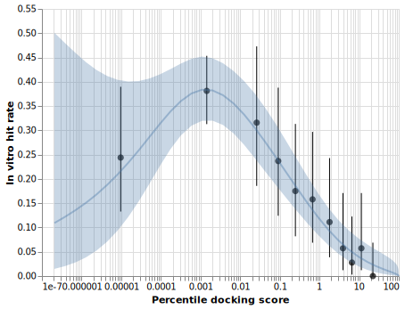
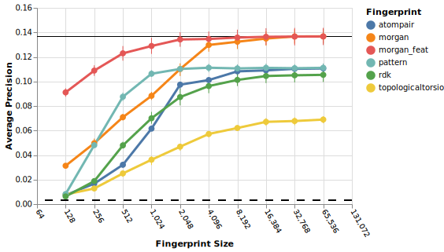
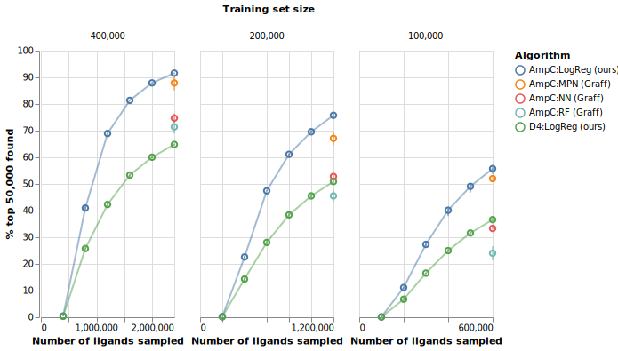
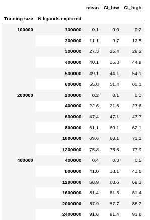
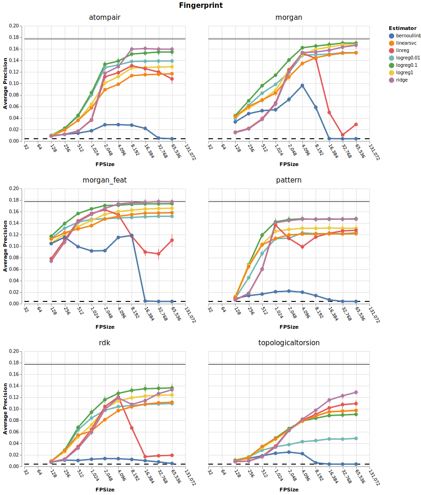

# dockop

Ultra-large scale (100 to 1000 million ligands) virtual molecule libraries are now available from suppliers like Enamine or WuXi. The increased size yields better diversity of high-scoring molecules in a docking campaign, but requires more infrastructure like high-performance computing clusters. The aim of this project was to show that the same hits coud be identified without docking the entire library by training a surrogate model on a random sample of ligands and their docking scores and using that instead. The approach uses just _sklearn_'s LogisticRegression and _RDKit_'s Morgan fingerprints with pharmacophoric atom invariants. 

[1] Lyu, Jiankun, et al. "Ultra-large library docking for discovering new chemotypes." Nature 566.7743 (2019): 224-229.


### results:



I fit a GAM to the _in vitro_ hit rate data in Lyu et al, which nicely shows the dip in hit rate at very high ranks (referred to by Shoichet/Iriwn as "the scum [that] rises to the top"). This also helps to define a cut-off point - we might not care for the top 50,000 ligands if, for example, the library is 300 million and 30,000 of them are going to be 'scum'. Instead, I set the cut-off to 0.3%, which has about a half-maximal hit-rate. In any practical setting, the hit rates achieved below this cut-off (including the scum to be honest) would be more than acceptable.  


With a cut-off, we can now binarize the ligands into 'high-scoring' and 'low-scoring' classes, and use a classifier, i.e. logistic regression. Comparing some fingerprints and logistic regression using the average precision metric:



Below you can see that the D4 receptor dataset performs a bit worse in all expertiments. If you are concerned about the fingerprint search overfitting at the AmpC receptor, note that Morgan fingerprints with pharmacophoric invariants still perform best on the D4 dataset:

[fpcomp2](./figures/fpsize_logreg_d4.svg)


Interestingly, simply increasing the size of fingerprints beyond what is commonly used in the field (2,048) improves performance a lot! In addition, Morgan fingerprints, often considered a baseline, perform best. Actually, when you use larger Morgan fingerprints they can perform at least as well as a graph neural network (huge shout out for the pioneering work there [2]):



[2]Graff, David E., Eugene I. Shakhnovich, and Connor W. Coley. "Accelerating high-throughput virtual screening through molecular pool-based active learning." arXiv preprint arXiv:2012.07127 (2020).


To get the raw data in this figure, type:

```python
import pandas as pd

df = pd.read_csv('./processed_data/ampc_reconstruction_0.3_1_.csv')

out = pd.DataFrame(df.groupby(['Training size', 'N ligands explored'])['% top-k found'].agg([np.mean, stats.sem])*100)
out['CI_low'] = np.around(out['mean'] - out['sem'] * stats.t.ppf((1+0.95)/ 2., 3-1), 1)
out['CI_high'] = np.around(out['mean'] + out['sem'] * stats.t.ppf((1+0.95)/ 2., 3-1), 1)
out['mean'] = np.around(out['mean'], 1)
out = out.drop('sem', axis=1)
out
```
yielding:




### discussion

The ROC curve from a simple test/train split using LogisticRegression is almost perfect. Why does such a simple technique perform so well at predicting docking scores? Compare to bioactivity virtual screening - LogReg and Morgan fingerprints are actually criticized a lot for not generalizing. Perhaps the shift to true random sampling of the training and test sets (as opposed to highly biased sampling in bioactivity data) complies better with the assumptions behind logistic regression, and increases the actual chemical diversity beyond what you would have for the same number of ligands in, say, ChEMBL.     

The manuscript just uses LogisticRegression with default settings because I found that performs	best consistently. But you might be interested in trying other classifiers, hyperparameters
, or regressors. If so,	check out this bonus figure first. It might look like Ridge regressors perform best, and they do perform well, but I found it didn't carry through to the iterative docking retrieval task. Note how BernoulliNB and LinearRegression perform worse at higher fp sizes, implying shrinkage is important. I didn't look at nonlinear estimators like kernel regression or SVMs with kernels, due to poor scaling. 



### reproduce any of the figures

Use this environment:

`conda env create -f dockop.yml`

and look in `./code` for instructions.
