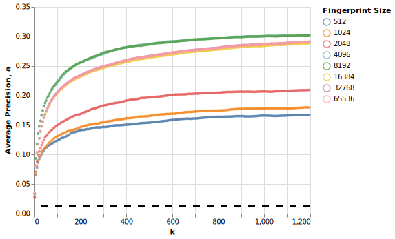
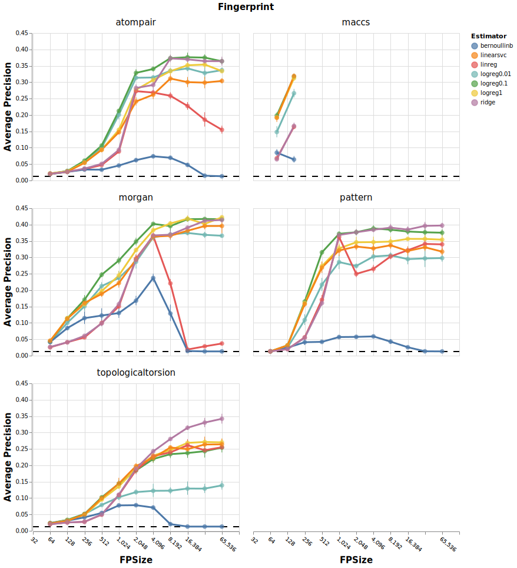
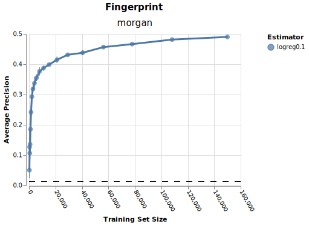
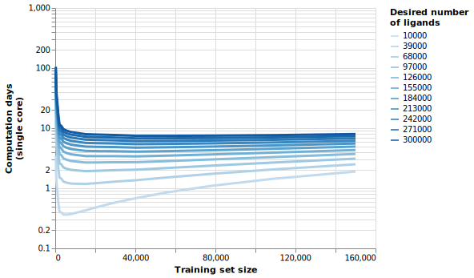

# dockop
 faster docking by combining with classifiers or regressors.

Can we speed up a docking campaign to the point where we don't need high-performance computing? Using existing docking data from [1], this project simulates a docking campaign by 'docking' a small number of ligands (e.g. 15,000 - achievable in a day on a single computer) and then fitting classifiers or regressors on the docking scores. These models can then be used to rank the remaining, undocked, ligands in order of likelihood to score highly. Using the ranked ligands, one can enrich their docking results with hits by over an order of magnitude over random search. 

`conda env create -f dockop.yml`

[1] Lyu, Jiankun, et al. "Ultra-large library docking for discovering new chemotypes." Nature 566.7743 (2019): 224-229.

## Benchmark approach - kNN classifiers
kNN classifiers are the simplest 'model' available, and even they perform quite well. On the other hand, with a training set of 15,000 docked ligands, this approach is quite expensive because it requires `k` to be set very high, ~1000 or so (dotted line is the average precision for unoptimised docking):

## Faster approaches:
Linear hyperplane classifiers are fast to fit and may perform better than kNN for having less variance. Seen below is a comparison of several classifiers or regressors trained on 15,000 docking scores, using multiple fingerprint types and multiple fingerprint sizes.

- As above, size does matter. Bit collisions prevent good results.
- Combination of Morgan FP, 4096, and logistic regression classifier with `C` parameter of `0.1` is a great tradeoff in size, time, and performance. In reality `sklearn` is so fast that you might as well use the full 65,536 fp size, assuming you use sparse representations, because the regularization of the model prevents all those empty columns from interfering.

## How many ligands are required in the training set?

The more ligands used in training the model, the better that model performs. Obviously this leads to a trade-off - you can get a better model by docking lots of ligands, but then you save less time using the model. What to do?

